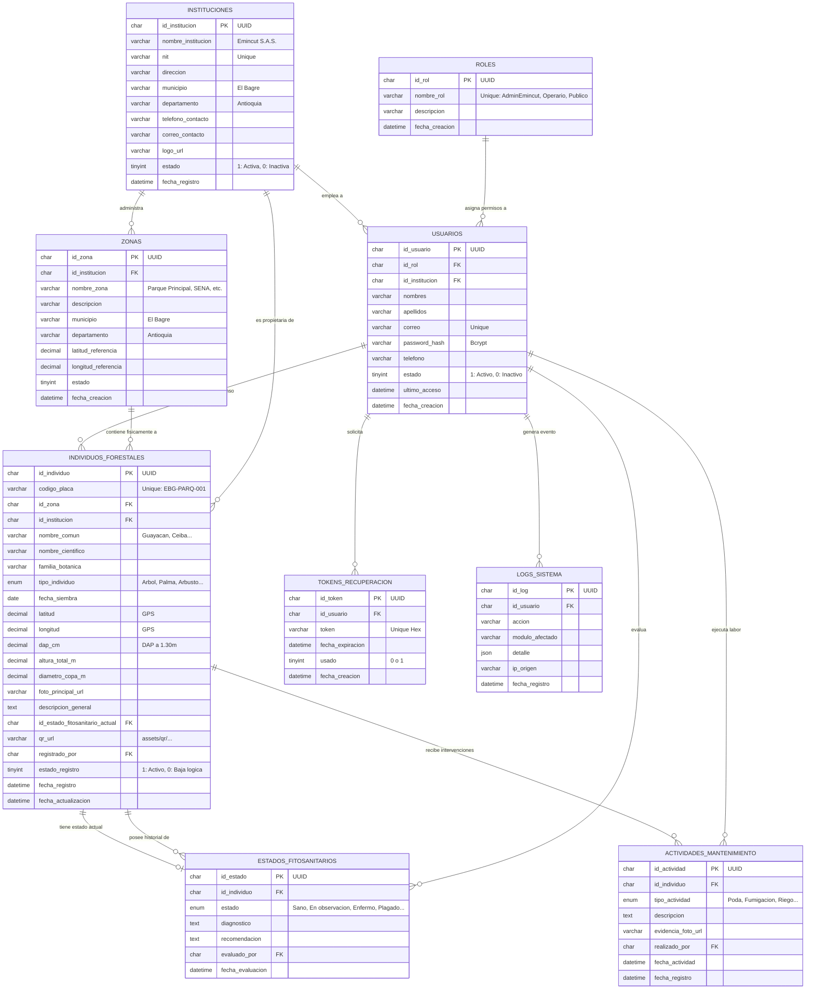

# Diagrama Entidad-Relación — ForestID (Emincut)

Diagrama de las 8 tablas en sus 4 capas lógicas para la base de datos `forestsrd_db`.

```mermaid
erDiagram
    ROLES ||--o{ USUARIOS : "asigna permisos a"
    INSTITUCIONES ||--o{ USUARIOS : "emplea a"
    INSTITUCIONES ||--o{ ZONAS : "administra"
    INSTITUCIONES ||--o{ INDIVIDUOS_FORESTALES : "es propietaria de"
    ZONAS ||--o{ INDIVIDUOS_FORESTALES : "contiene fisicamente a"
    USUARIOS ||--o{ TOKENS_RECUPERACION : "solicita"
    USUARIOS ||--o{ INDIVIDUOS_FORESTALES : "registra en censo"
    USUARIOS ||--o{ ESTADOS_FITOSANITARIOS : "evalua"
    USUARIOS ||--o{ ACTIVIDADES_MANTENIMIENTO : "ejecuta labor"
    USUARIOS ||--o{ LOGS_SISTEMA : "genera evento"
    
    INDIVIDUOS_FORESTALES ||--o{ ESTADOS_FITOSANITARIOS : "posee historial de"
    INDIVIDUOS_FORESTALES ||--o{ ACTIVIDADES_MANTENIMIENTO : "recibe intervenciones"
    INDIVIDUOS_FORESTALES ||--o| ESTADOS_FITOSANITARIOS : "tiene estado actual"

    ROLES {
        char id_rol PK "UUID"
        varchar nombre_rol "Unique: AdminEmincut, Operario, Publico"
        varchar descripcion
        datetime fecha_creacion
    }

    INSTITUCIONES {
        char id_institucion PK "UUID"
        varchar nombre_institucion "Emincut S.A.S."
        varchar nit "Unique"
        varchar direccion
        varchar municipio "El Bagre"
        varchar departamento "Antioquia"
        varchar telefono_contacto
        varchar correo_contacto
        varchar logo_url
        tinyint estado "1: Activa, 0: Inactiva"
        datetime fecha_registro
    }

    USUARIOS {
        char id_usuario PK "UUID"
        char id_rol FK
        char id_institucion FK
        varchar nombres
        varchar apellidos
        varchar correo "Unique"
        varchar password_hash "Bcrypt"
        varchar telefono
        tinyint estado "1: Activo, 0: Inactivo"
        datetime ultimo_acceso
        datetime fecha_creacion
    }

    TOKENS_RECUPERACION {
        char id_token PK "UUID"
        char id_usuario FK
        varchar token "Unique Hex"
        datetime fecha_expiracion
        tinyint usado "0 o 1"
        datetime fecha_creacion
    }

    ZONAS {
        char id_zona PK "UUID"
        char id_institucion FK
        varchar nombre_zona "Parque Principal, SENA, etc."
        varchar descripcion
        varchar municipio "El Bagre"
        varchar departamento "Antioquia"
        decimal latitud_referencia
        decimal longitud_referencia
        tinyint estado
        datetime fecha_creacion
    }

    INDIVIDUOS_FORESTALES {
        char id_individuo PK "UUID"
        varchar codigo_placa "Unique: EBG-PARQ-001"
        char id_zona FK
        char id_institucion FK
        varchar nombre_comun "Guayacan, Ceiba..."
        varchar nombre_cientifico
        varchar familia_botanica
        enum tipo_individuo "Arbol, Palma, Arbusto..."
        date fecha_siembra
        decimal latitud "GPS"
        decimal longitud "GPS"
        decimal dap_cm "DAP a 1.30m"
        decimal altura_total_m
        decimal diametro_copa_m
        varchar foto_principal_url
        text descripcion_general
        char id_estado_fitosanitario_actual FK
        varchar qr_url "assets/qr/..."
        char registrado_por FK
        tinyint estado_registro "1: Activo, 0: Baja logica"
        datetime fecha_registro
        datetime fecha_actualizacion
    }

    ESTADOS_FITOSANITARIOS {
        char id_estado PK "UUID"
        char id_individuo FK
        enum estado "Sano, En observacion, Enfermo, Plagado..."
        text diagnostico
        text recomendacion
        char evaluado_por FK
        datetime fecha_evaluacion
    }

    ACTIVIDADES_MANTENIMIENTO {
        char id_actividad PK "UUID"
        char id_individuo FK
        enum tipo_actividad "Poda, Fumigacion, Riego..."
        text descripcion
        varchar evidencia_foto_url
        char realizado_por FK
        datetime fecha_actividad
        datetime fecha_registro
    }

    LOGS_SISTEMA {
        char id_log PK "UUID"
        char id_usuario FK
        varchar accion
        varchar modulo_afectado
        json detalle
        varchar ip_origen
        datetime fecha_registro
    }
```
